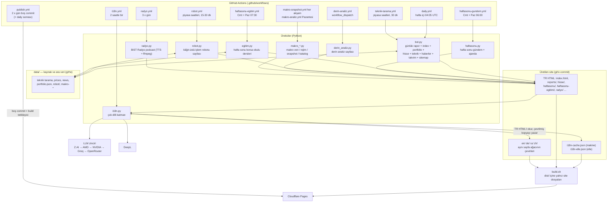

# ARCHITECTURE — borsa-raporlari

Türkçe BIST 30 finans sitesi: Python botları statik HTML üretir, git'e commit edilir,
Cloudflare Pages yayımlar. Çok dillilik (en/de/ru/zh) ayrı bir çeviri katmanıdır;
TR sayfalar asla bot dışından değiştirilmez.

## Modül haritası ve veri akışı

## Modül sorumlulukları (satır başına bir görev)

- **bot.py** — günlük rapor üreticisi: piyasa verisi çeker, rapor + `index.html` +
  portfolio/teknik/haber/takvim/sözlük sayfalarını yazar; çeviri YAPMAZ (2026-09-21'den
  beri çeviri ayrı workflow'da). Ana sayfa kartları (`_ders_konusu`, `_tr_tarih_sade`)
  ders dosyasından günün konusunu çıkarır; ders dosyası yoksa statik yedek metne döner.
- **egitim.py** — hafta sonu borsa okulu: Cmt/Paz ders üretir,
  `haftasonu-egitimi.html` + `haftasonu-egitimi/<tarih>.html` yazar; müfredat
  deterministik, içerik LLM.
- **haftasonu.py** — hafta sonu gündem ajanı: Cmt/Paz haber toplayıp
  `haftasonu.html` + arşiv yazar; hafta içi çalıştırılırsa FORCE olmadan no-op.
- **robot.py** — kâğıt-üstü işlem robotu: bot.py'den tamamen bağımsız; sinyalleri
  simüle emirlerle işler, `robot.html` + `data/robot/` yazar.
- **i18n.py** — çok dilli katman: TR sayfaları metin parçalarına ayırıp
  `SOZLUK (kod içi) → i18n-elle.json (insan) → i18n-cache.json (makine) → sağlayıcı
  (llm→deepl→"")` zinciriyle çevirir; `en/de/ru/zh/` ağacını yazar, sitemap'i
  günceller, TR sayfaların değişmediğini doğrular (`--dogrula`, `--esdeger`).
  Anahtar = `dil:sha1(göbek metin)[:20]`. mock/off sağlayıcıyla tam site üretimi
  kilitli (22.09 olayı). Kısa (≤60 karakter) dizelerde önbellek değeri kaynağa
  birebir eşitse bile kabul edilir — bilinen zehir girişi (bkz. aşağı).
- **derin_analiz.py** — derin analiz sayfasını günlük bottan bağımsız üretir
  (workflow_dispatch; ZAI anahtarı yoksa yazmadan çıkar).
- **makro_*.py** — makro katman: `makro_veri/katalog` (veri + tanımlar),
  `makro_rejim` (kural tabanlı rejim etiketi, `data/makro-rejim/`),
  `makro_snapshot` (akşam göstergeleri), `makro_analiz` sayfası üretimi.
- **radyo.py** — BIST Radyo: iki kurgusal sunuculu piyasa sohbeti; edge-tts +
  ffmpeg ile MP3, `radyo/<tarih>-<bölüm>.mp3` + indeks günceller.
- **build.sh** — Cloudflare Pages build adımı: yalnızca site dosyalarını (HTML,
  CSS, json, görsel, dil klasörleri) `dist/`'e kopyalar; kaynak kod ve `data/`
  yayımlanmaz (`.assetsignore` ile ikinci katman).
- **.github/workflows** — üretim takvimi (bkz. diyagram): `daily.yml` rapor,
  `i18n.yml` 2 saatte bir çeviri (`[CI Skip]` commit), `publish.yml` günde 2 kez
  boş "Site yayini" commit'i ile Cloudflare build'ini tetikler; `[CI Skip]` içeren
  commit'ler build başlatmaz.
- **data/** — tek doğruluk kaynağı: teknik tarama çıktıları, fiyat serileri,
  haberler, portföy geçmişi, robot günlüğü, makro snapshot/rejim. Botlar bunun
  üzerine yazan deterministik + LLM destekli HTML üretir.
- **reports/ + en/de/ru/zh/** — üretilen çıktı git'te yaşar; deploy = git checkout.
  TR sayfa ile dil kopyası arasındaki yapısal eşdeğerlik `i18n.py --esdeger` ile
  denetlenir.

## Çeviri öncelik zinciri (cevir_liste)

1. `SOZLUK` — i18n.py içinde elle sabitlenmiş arayüz metinleri (tam eşleşme).
2. `i18n-elle.json` — insan/asistan çevirileri, anahtar `dil:sha1[:20]`
   (üretim aracı: `elle_ekle.py`).
3. `i18n-cache.json` — makine çevirisi önbelleği; değeri kaynağa birebir eşit
   uzun (>60 karakter) kayıtlar geçersiz sayılır.
4. Sağlayıcı zinciri: `llm` (Z.AI → AMD → NVIDIA → Groq → OpenRouter) → `deepl`
   → boş string (çevrilmemiş TR kalır, sıradaki koşuda yeniden denenir).

## Bilinen riskler

- **Zehirli önbellek kaydı**: kısa dizelerde kimlik-çeviri kabulü + alıntı-sarmallı
  TR çıktı + denetimsiz elle kayıt, "çevrilmiş" görünen Türkçe metin üretebilir.
  Okuma/yazma yolunda dil-bağımsız geçerlilik kontrolü önerilir (2026-10-05 incelemesi).
- **Ana sayfa index.html elle yamalı**: 2026-10-05 itibarıyla depodaki index.html
  (ve 4 dil kopyası) geçerli `build_index_html` çıktısı değildir; sıradaki
  `daily.yml` koşusu onu doğal haliyle yeniden üretir.
